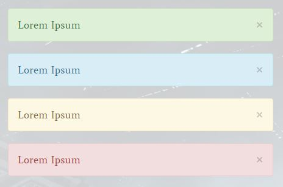
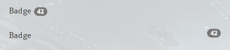
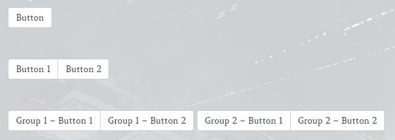
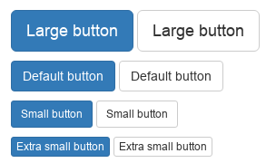
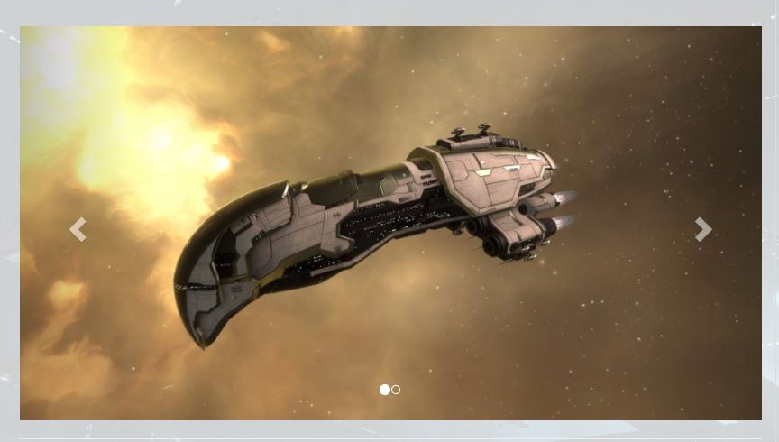

# Shortcodes

### Shortcode: ```[alert]```



```
[alert]Lorem Ipsum[/alert]

[alert type="info" dismissable="true"]Lorem Ipsum[/alert]

[alert type="warning" dismissable="true"]Lorem Ipsum[/alert]

[alert type="danger" dismissable="true"]Lorem Ipsum[/alert]
```

### Shortcode: ```[badge]```



```
Badge [badge]42[/badge]

Badge [badge right="true"]42[/badge]
```

### Shortcode: ```[breadcrumb]``` and ```[breadcrumb-item]```


```
[breadcrumb][breadcrumb-item link="https://test.de"]Lorem[/breadcrumb-item][breadcrumb-item link="https://test.de"]Ipsum[/breadcrumb-item][breadcrumb-item active="true"]Dolor[/breadcrumb-item][/breadcrumb]
```

This has to be in one line, because of the way the WordPress editor is handling line breaks.

The ```[button]``` shortcode generates a link-button styled with bootstrap.

Accepted options are:
- type => default, primary, success, info, warning, danger, link (default when not given: default)
- size => lg, sm, xs
- link => Your link
- target => _blank, _new (default when not given opens the link in the same page)



Examples Button Type:


Examples Button Size:



```
[button link="https://test.de" target="_blank" title="Test Button"]Button[/button]
```

```
[button-group][button link="https://test.de" target="_blank" title="Test Button 1"]Button 1[/button][button link="https://test.de" target="_blank" title="Test Button 2"]Button 2[/button][/button-group]
```

```
[button-toolbar][button-group][button link="https://test.de" target="_blank" title="Test Button 1 Group 1"]Group 1 - Button 1[/button][button link="https://test.de" target="_blank" title="Test Button 2 Group 1"]Group 1 - Button 2[/button][/button-group][button-group][button link="https://test.de" target="_blank" title="Test Button 1 Group 2"]Group 2 - Button 1[/button][button link="https://test.de" target="_blank" title="Test Button 2 Griup 2"]Group 2 - Button 2[/button][/button-group][/button-toolbar]
```

This has to be in one line, because of the way the WordPress editor is handling line breaks.

### Shortcode: ```[carousel]``` and ```[carousel-item]```



```[carousel][carousel-item][/carousel-item][carousel-item][/carousel-item][/carousel]```

This has to be in one line, because of the way the WordPress editor is handling line breaks.
